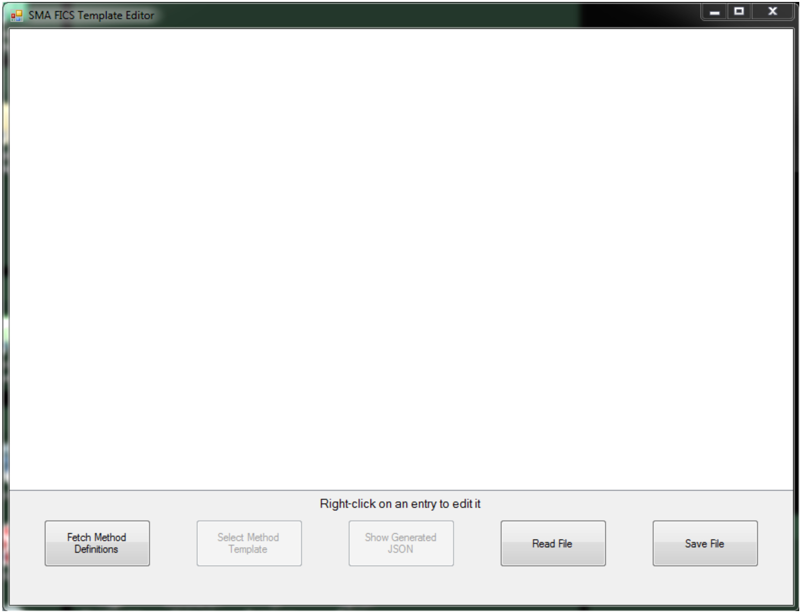
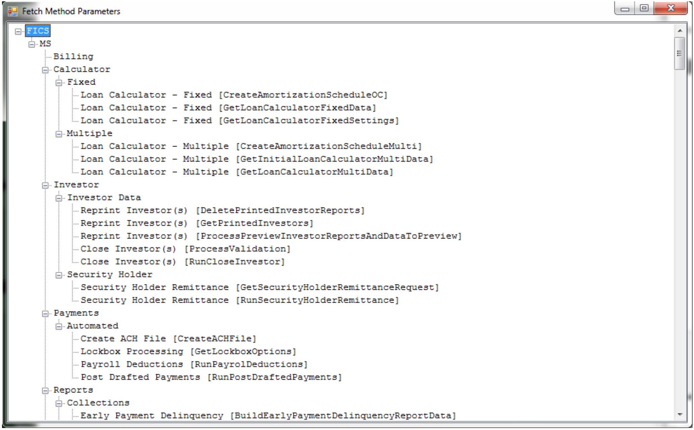
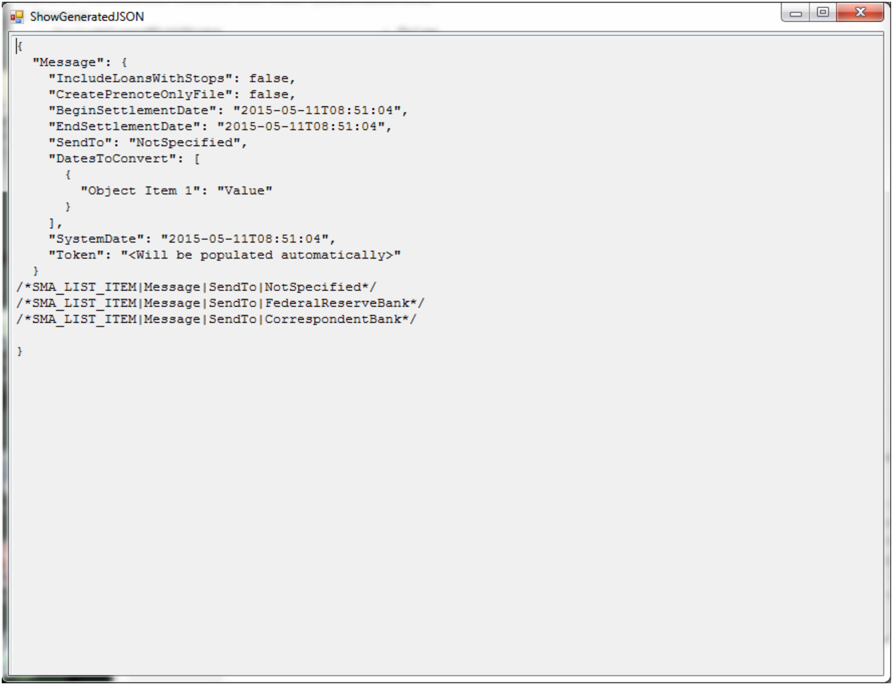
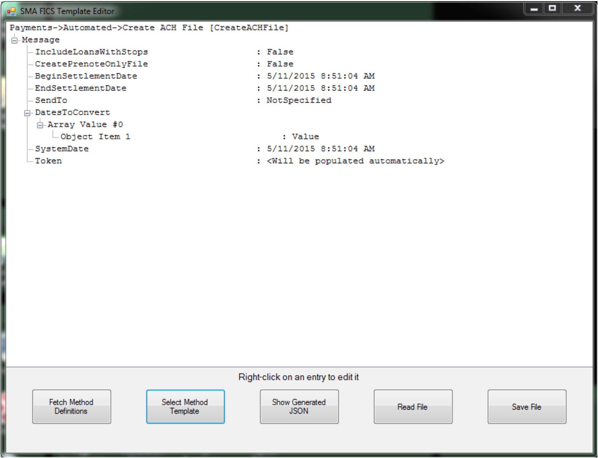
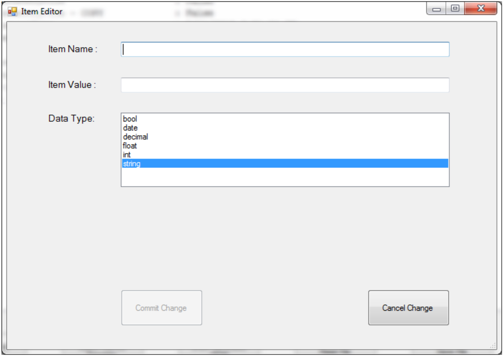
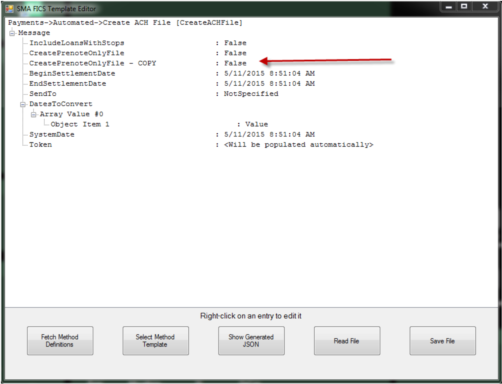
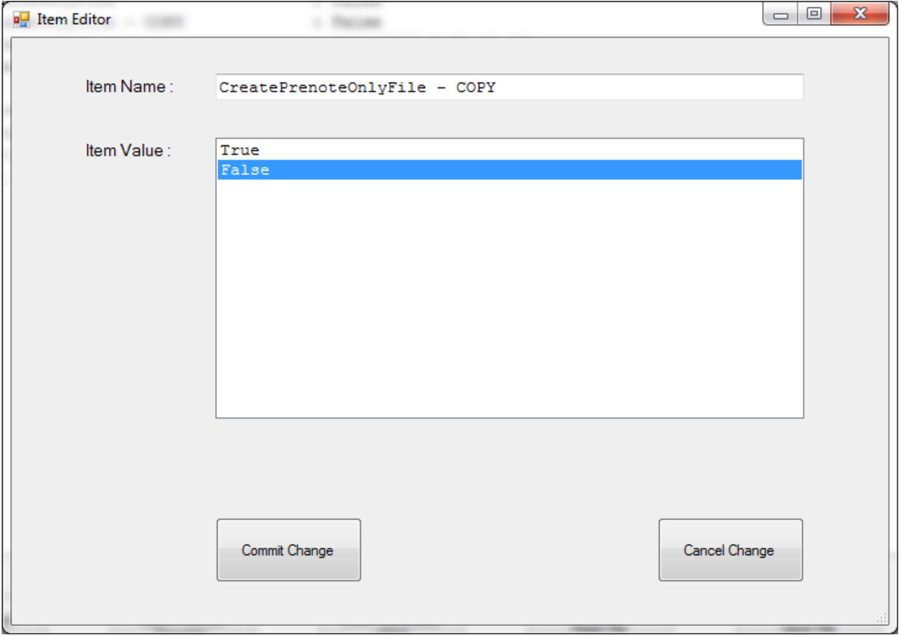

# SMAFICSTemplateEditor

## What is it?

SMAFICSTemplateEditor is a Windows-based editor that allows you to modify the template file copied from the FICS documentation website. The template editor maintains the data types of each field and the format of the request.

- Use this tool when you want to build or modify a FICS request template file without manually editing JSON
- Use this tool to ensure data types and JSON structure are preserved when adding or removing fields

:::note
This tool is optional. If a required data structure cannot be built using the available functions, the request file can be edited in Notepad or another suitable editor.
:::

## Walkthrough

When a template file is first opened, it appears similar to the following:



At this point, you can load a request file in one of two ways:

- Select the **Read File** button to open an existing request file
- Select the **Fetch Method Definitions** button to load the available definitions from the web service, then select the **Select Method Template** button to choose a method

When you select the **Fetch Method Definitions** button, a wait cursor appears and then all buttons become enabled. Selecting the **Select Method Template** button displays a screen similar to the following:



This list is sorted by Folder, then Sub-Folder, then Method Name. Because some Program Names are duplicated (for example, `Reprint Investors (s)`), the actual Method Name is shown in brackets to help identify the desired functionality.

Select one of the Program Name lines to load its definition in the edit window. For example, selecting `Create ACH File [CreateACHFile]` displays the request information as follows:


The selected method is displayed as the first line (`Payments -> Automated -> Create ACH File [CreateACHFile]`). Different types of data are displayed. There are simple items (such as `IncludeLoansWithStops` or `Object Item 1`) and groups (such as `Array Value #0`) that contain a collection of items.

:::note
Group names are not included in the final request file. They are shown only to help you understand the structure.
:::

There are also containers (such as `DatesToConvert`) that contain multiple objects (either items or groups).

At any time, select the **Show Generated JSON** button to preview what the request file will look like when saved. Before making any changes, the **Show Generated JSON** button displays the following:



:::note
There may be comment lines at the bottom of the file that the toolkit components use to maintain the data type or available selection choices. For example, the selection choices for `SendTo` are:
- `NotSpecified`
- `FederalReserveBank`
- `CorrespondentBank`
:::



### Right-click options

#### On a container

If you right-click a container line, a pop-up menu offers the choice of **InsertGroup**.

**InsertGroup** creates a new group entry immediately below the container line. New items can then be inserted into the new group.

#### On a group

If you right-click a group line, a pop-up menu offers the following choices:

- **Delete Group**
- **Duplicate Group**
- **Insert New Items**

**Delete Group** removes the group and all of its descendants from the request definition.

**Duplicate Group** creates a new group containing copies of all descendants of the selected group.

**Insert New Item** displays the new item entry screen:



:::note
OpCon global properties can be used **only** for data type strings and dates. SMAFICSConnector performs the substitution before sending the request to the web service.
:::

After entering data in the **Item Name** and **Item Value** fields, select the **Commit Change** button. The new item is created immediately after the selected group.

#### On an item

If you right-click an item line, a pop-up menu offers the following choices:

- **Delete Item**
- **Duplicate Item**
- **Edit Item**
- **Insert Item**

**Delete Item** removes the item from the request definition.

**Duplicate Item** creates a similarly named item (`- COPY` is appended to the item name) immediately below the selected item. In the following screenshot, the user right-clicked `CreatePrenoteOnlyFile` and selected **Duplicate Item**:



Selecting **Edit Item** opens an editing window. You can rename the newly created duplicate of `CreatePrenoteOnlyFile` or change its value:



The original data type is preserved.

To create a new item with a different data type, select **Insert Item**. The following edit window is displayed:


:::note
OpCon global properties can be used only for data type strings and dates. SMAFICSConnector performs the substitution before sending the request to the web service.
:::

After entering data in the **Item Name** and **Item Value** fields, select the **Commit Change** button. The new item is created immediately after the selected item.

## Configuration settings

SMAFICSTemplateEditor uses a configuration file to connect to your FICS environment. The following is an example configuration file:

```
##############################################
#
#    This configuration file is used by
#    SMAFICSTemplateEditor.
#
##############################################
[General]

[Web Service Connection Parameters]
LoginConnectionName=
MethodDocumentationURL=
SpecialsDocumentationURL=
MethodExampleBaseURL=
RequestTimeoutInMilliseconds=
```

| Setting | Default | What it does |
|---|---|---|
| `LoginConnectionName` | *(none)* | Defines the FICS connection name (database) to connect to. Must match the `LoginConnectionName` in `SMAFICSConnector.ini`. |
| `MethodDocumentationURL` | *(none)* | Defines the URL that returns documentation for the available web service methods. FICS can supply this information. |
| `SpecialsDocumentationURL` | *(none)* | Defines the URL that returns documentation for the available special web service methods. The `LoginConnectionName` value is appended as a query parameter (`?connectionName=`). FICS can supply this information. |
| `MethodExampleBaseURL` | *(none)* | Defines the base URL that returns documentation for a specific web service method. The method name is appended as a query parameter (`?methodName=`). FICS can supply this information. |
| `RequestTimeoutInMilliseconds` | `60000` | Defines the maximum number of milliseconds to wait for the method documentation call to complete. If the call does not complete within this time, the application displays an error message. |

**Related topics:**

- [FICS Connector overview](./overview.md)
- [SMAFICSConnector](./sma-fics-connector.md)

## FAQs

**Is SMAFICSTemplateEditor required to create request files?**

No. SMAFICSTemplateEditor is optional. You can create and edit request files in any text editor. The tool is recommended when you need to preserve data types and JSON structure without manually editing the file.

**What is the difference between a container, a group, and an item?**

A container holds multiple groups. A group holds multiple items. An item is a single name-value pair in the request. Groups and items can be added, duplicated, or deleted using right-click options.

**Where do I get the FICS URL values for the configuration file?**

The `MethodDocumentationURL`, `SpecialsDocumentationURL`, and `MethodExampleBaseURL` values are provided by FICS. Contact your FICS representative to obtain these URLs.

**Can I use OpCon properties in item values?**

Yes, but only for data type strings and dates. SMAFICSConnector substitutes the OpCon property value before sending the request to the web service.

## Glossary

**Container** — A structural element in SMAFICSTemplateEditor that holds one or more groups. Containers are not included in the final request file; they are displayed only to show structure.

**Group** — A structural element that holds one or more items. Groups are not included in the final request file but represent a logical collection of related fields.

**Item** — A single name-value pair in the request template. Items map directly to fields in the FICS web service request.

**LoginConnectionName** — The identifier for the FICS database connection. Must match the value configured in `SMAFICSConnector.ini`.

**MethodDocumentationURL** — The URL provided by FICS that returns documentation for all available web service methods.

**MethodExampleBaseURL** — The base URL provided by FICS that returns documentation for a specific web service method. The method name is appended as a query parameter (`?methodName=`).

**SpecialsDocumentationURL** — The base URL provided by FICS that returns documentation for special web service methods. The `LoginConnectionName` value is appended as a query parameter (`?connectionName=`).
